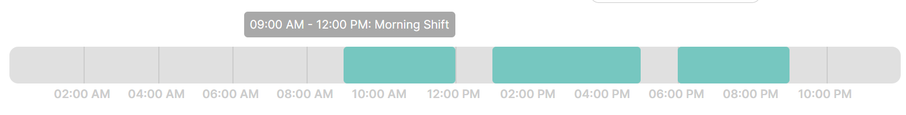
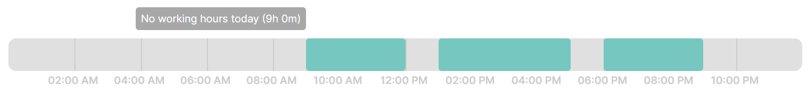
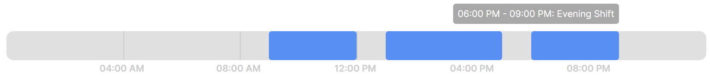

# React Daily TimeLine Sheet

A customizable timeline component for React applications. The `React Daily TimeLine Sheet` component visualizes working and non-working hours in a horizontal timeline, making it ideal for time-tracking apps, schedules, and other applications where time management is key.

### React Daily TimeLine Sheet

Here are some visual examples of the TimeLine component:

- 
- 
- 

## Features

- **Customizable Colors and Styles:** Easily configure colors for working and non-working segments, and adjust height and border-radius.
- **Flexible Time Formats:** Choose between 12-hour and 24-hour time formats to match your application's requirements.
- **Custom Tooltips:** Optionally provide a custom tooltip renderer for more personalized information display.
- **Responsive Breakpoints:** Automatically adjust the timeline’s intervals based on responsive breakpoints.
- **Non-working Hours Support:** Display non-working hours with a customizable caption when no working hours are available.

## Installation

Install the `React Daily TimeLine Sheet` component via NPM:

```bash
npm install react-daily-timeline-sheet
```

## Usage

Basic Example
Import and use the React Daily TimeLine Sheet in your React project:

```bash
import React from 'react';
import TimeLine from 'react-daily-timeline-sheet';

const workingHours = [
  {
    start: '09:00',
    end: '17:00',
    title: 'Work',
    status: 'InProgress',
  },
  // Add more working hours as needed
];

const App = () => {
  return (
    <div>
      <h1>My TimeLine</h1>
      <TimeLine
        workingHours={workingHours}
      />
    </div>
  );
};

export default App;
```

## Custom Example
Import and use the React Daily TimeLine Sheet in your React project:

```bash
import React from 'react';
import TimeLine from 'react-daily-timeline-sheet';

const workingHours = [
  {
    start: '09:00',
    end: '17:00',
    title: 'Work',
    status: 'InProgress',
  },
  // Add more working hours as needed
];

const renderTooltip = (segment: any) => (
  <div
    style={{
      padding: "5px",
      backgroundColor: "#4d4d4c",
      color: "#fff",
      borderRadius: "3px",
    }}
  >
    <strong>{segment.tooltip}</strong>
    {segment.status && <div>Status: {segment.status}</div>}
  </div>
);

const App = () => {
  return (
    <div>
      <h1>My TimeLine</h1>
     <TimeLine
        workingHours={[
          { start: "09:00", end: "12:00", title: "Morning Shift" },
          { start: "13:00", end: "17:00", title: "Afternoon Shift" },
          { start: "18:00", end: "21:00", title: "Evening Shift" },
        ]}
        breakpoint="lg"
        workingColor="#578ff2"
        nonWorkingColor="#e0e0e0"
        height="50px"
        borderRadius="12px"
        timeFormat="12h"
        notWorkingCaption="No working hours today"
        renderTooltip={renderTooltip}
      />
    </div>
  );
};

export default App;
```

## Custom Tooltips

To customize the tooltip displayed for each segment, use the renderTooltip prop:

```bash
import React from 'react';
import TimeLine from 'react-daily-timeline-sheet';

const customTooltip = (segment) => (
  <div>
    <strong>{segment.tooltip}</strong>
  </div>
);

const workingHours = [
  {
    start: '09:00',
    end: '17:00',
    title: 'Work',
    status: 'InProgress',
  },
  // Add more working hours as needed
];

const App = () => {
  return (
    <div>
      <h1>My Custom TimeLine</h1>
      <TimeLine
        workingHours={workingHours}
        renderTooltip={customTooltip}
        workingColor="#76c7c0"
        nonWorkingColor="#e0e0e0"
        height="40px"
        borderRadius="12px"
        timeFormat="24h"
        notWorkingCaption="No work"
      />
    </div>
  );
};

export default App;

```

## Props

## TimeLine Component Props

| Prop               | Type                      | Default    | Description                                                    |
|--------------------|---------------------------|------------|----------------------------------------------------------------|
| `workingHours`     | `WorkingHour[]`           | `[]`       | Array of working hours to display. Each object should include `start`, `end`, `title`, and optionally `status`. |
| `breakpoint`       | `"md" | "lg"`             | `"lg"`     | Breakpoint for adjusting interval display (4 hours for "md", 2 hours for "lg"). |
| `workingColor`     | `string`                  | `"#76c7c0"`| Color for the working hours segments.                         |
| `nonWorkingColor`  | `string`                  | `"#e0e0e0"`| Color for the non-working hours segments.                     |
| `height`           | `string`                  | `"40px"`   | Height of the timeline.                                       |
| `borderRadius`     | `string`                  | `"12px"`   | Border radius of the timeline.                                |
| `timeFormat`       | `"12h" | "24h"`           | `"12h"`    | Time format for displaying hours.                             |
| `notWorkingCaption`| `string`                  | `"Not working at this time"` | Caption to display when there are no working hours available. |
| `renderTooltip`    | `(segment: Segment) => React.ReactNode` | - | Custom function to render tooltips for each segment. If not provided, a default tooltip is used. |

## WorkingHour Interface

| Property   | Type   | Description                                  |
|------------|--------|----------------------------------------------|
| `start`    | `string` | Start time in HH format.                   |
| `end`      | `string` | End time in HH format.                     |
| `title`    | `string` | Title or description of the shift.         |
| `status`   | `string` | (Optional) Status of the shift.            |

## Segment Interface

| Property      | Type   | Description                             |
|---------------|--------|-----------------------------------------|
| `type`        | `"working" | "non-working"` | Type of segment.                       |
| `startPercent`| `number` | Start position as a percentage.        |
| `widthPercent`| `number` | Width of the segment as a percentage.  |
| `tooltip`     | `string` | Tooltip text to be displayed.          |
| `status`      | `string` | (Optional) Status of the working segment.|


